# 自动亮度调节功能概要设计文档

## 目录

1. [功能概述](#1-功能概述)
   - 1.1 系统架构图
2. [核心组件](#2-核心组件)
   - 2.1 AutoBrightnessManager
   - 2.2 SensorProxyClient
   - 2.3 BrightnessTransition
   - 2.4 配置管理
3. [状态机](#3-状态机)
   - 3.1 自动亮度状态转换
4. [数据结构](#4-数据结构)
   - 4.1 AutoBrightnessConfig
   - 4.2 AutoBrightnessManager 状态字段
   - 4.3 BrightnessTransition 数据结构
5. [核心流程](#5-核心流程)
   - 5.1 初始化流程
   - 5.2 启动流程
   - 5.3 轮询流程
   - 5.4 停止流程
6. [关键算法](#6-关键算法)
   - 6.1 亮度计算算法
   - 6.2 调节判断逻辑
   - 6.3 渐变算法
   - 6.4 完整数据流图
7. [亮度渐变机制](#7-亮度渐变机制)
   - 7.1 渐变流程
   - 7.2 渐变控制
   - 7.3 渐变优化
   - 7.4 自动亮度与渐变集成
8. [手动调节处理](#8-手动调节处理)
   - 8.1 两种模式
   - 8.2 手动调节处理时序
   - 8.3 系统调整标志
9. [配置管理](#9-配置管理)
   - 9.1 DSettings 集成
   - 9.2 配置项
   - 9.3 动态更新
10. [异常处理](#10-异常处理)
    - 10.1 重试机制
    - 10.2 优雅降级
    - 10.3 服务恢复
11. [并发控制](#11-并发控制)
    - 11.1 锁策略
    - 11.2 Goroutine 管理
12. [系统集成](#12-系统集成)
    - 12.1 与 Display Manager 集成
    - 12.2 电源管理集成
    - 12.3 DBus 接口
13. [依赖关系](#13-依赖关系)
    - 13.1 外部依赖
    - 13.2 内部依赖
14. [测试要点](#14-测试要点)
    - 14.1 功能测试
    - 14.2 异常测试
    - 14.3 性能测试
15. [未来扩展](#15-未来扩展)
    - 15.1 算法优化
    - 15.2 功能增强
    - 15.3 性能优化
16. [典型使用场景](#16-典型使用场景)
    - 16.1 场景一：用户启用自动亮度
    - 16.2 场景二：环境光变化触发调节
    - 16.3 场景三：手动调节后的行为
    - 16.4 场景四：系统休眠与唤醒
17. [注意事项](#17-注意事项)

---

## 1. 功能概述

自动亮度调节功能通过环境光传感器自动调整显示器亮度，提升用户体验并节省电能。该功能集成在 StartDDE 的 display 模块中，支持灵活的配置和优雅的降级处理。

### 1.1 系统架构图

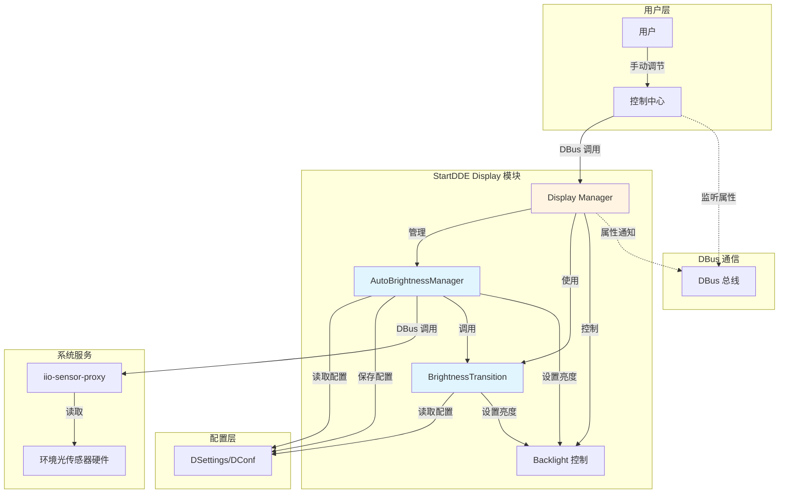
```mermaid
graph TB
    subgraph "用户层"
        User[用户]
        ControlCenter[控制中心]
    end
    
    subgraph "StartDDE Display 模块"
        Manager[Display Manager]
        ABM[AutoBrightnessManager]
        BT[BrightnessTransition]
        Backlight[Backlight 控制]
    end
    
    subgraph "配置层"
        DConf[DSettings/DConf]
    end
    
    subgraph "系统服务"
        SensorProxy[iio-sensor-proxy]
        Hardware[环境光传感器硬件]
    end
    
    subgraph "DBus 通信"
        DBus[DBus 总线]
    end
    
    User -->|手动调节| ControlCenter
    ControlCenter -->|DBus 调用| Manager
    Manager -->|管理| ABM
    Manager -->|使用| BT
    Manager -->|控制| Backlight
    
    ABM -->|读取配置| DConf
    ABM -->|保存配置| DConf
    BT -->|读取配置| DConf
    
    ABM -->|DBus 调用| SensorProxy
    SensorProxy -->|读取| Hardware
    
    ABM -->|调用| BT
    BT -->|设置亮度| Backlight
    ABM -->|设置亮度| Backlight
    
    Manager -.->|属性通知| DBus
    ControlCenter -.->|监听属性| DBus
    
    style ABM fill:#e1f5ff
    style BT fill:#e1f5ff
    style Manager fill:#fff4e1
```

## 2. 核心组件

### 2.1 AutoBrightnessManager

自动亮度管理器，负责整个功能的生命周期管理。

**主要职责：**
- 初始化和资源管理
- 配置加载和持久化
- 传感器数据采集和处理
- 亮度计算和应用
- 状态监控和异常处理

### 2.2 SensorProxyClient

传感器代理客户端，封装与 iio-sensor-proxy 服务的交互。

**主要功能：**
- 连接/断开传感器服务
- 声明/释放环境光传感器
- 读取光照强度数据
- 监听服务状态变化

### 2.3 BrightnessTransition

亮度渐变管理器，提供平滑的亮度过渡效果。

**主要功能：**
- 渐变效果的启用/禁用控制
- 渐变参数配置（时长、步进间隔）
- 多显示器独立渐变状态管理
- 渐变过程的启动、停止和中断处理
- 实时亮度值跟踪

### 2.4 配置管理

基于 DSettings (DConfig) 的配置系统，支持动态配置更新。

## 3. 状态机

### 3.1 自动亮度状态转换

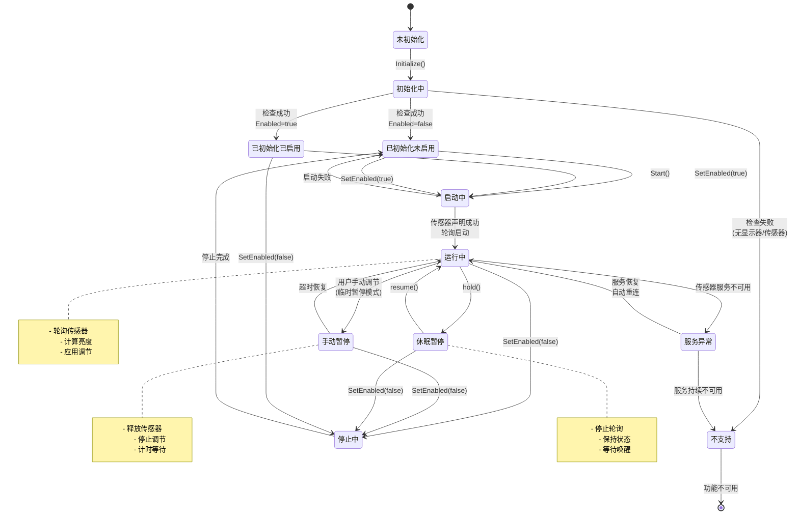
```mermaid
stateDiagram-v2
    [*] --> 未初始化
    
    未初始化 --> 初始化中: Initialize()
    
    初始化中 --> 不支持: 检查失败<br/>(无显示器/传感器)
    初始化中 --> 已初始化未启用: 检查成功<br/>Enabled=false
    初始化中 --> 已初始化已启用: 检查成功<br/>Enabled=true
    
    不支持 --> [*]: 功能不可用
    
    已初始化未启用 --> 启动中: SetEnabled(true)
    已初始化已启用 --> 启动中: Start()
    
    启动中 --> 运行中: 传感器声明成功<br/>轮询启动
    启动中 --> 已初始化未启用: 启动失败
    
    运行中 --> 手动暂停: 用户手动调节<br/>(临时暂停模式)
    运行中 --> 停止中: SetEnabled(false)
    运行中 --> 休眠暂停: hold()
    运行中 --> 服务异常: 传感器服务不可用
    
    手动暂停 --> 运行中: 超时恢复
    手动暂停 --> 停止中: SetEnabled(false)
    
    休眠暂停 --> 运行中: resume()
    休眠暂停 --> 停止中: SetEnabled(false)
    
    服务异常 --> 不支持: 服务持续不可用
    服务异常 --> 运行中: 服务恢复<br/>自动重连
    
    停止中 --> 已初始化未启用: 停止完成
    
    已初始化未启用 --> 启动中: SetEnabled(true)
    已初始化已启用 --> 停止中: SetEnabled(false)
    
    note right of 运行中
        - 轮询传感器
        - 计算亮度
        - 应用调节
    end note
    
    note right of 手动暂停
        - 释放传感器
        - 停止调节
        - 计时等待
    end note
    
    note right of 休眠暂停
        - 停止轮询
        - 保持状态
        - 等待唤醒
    end note
```

## 4. 数据结构

### 4.1 AutoBrightnessConfig

```go
type AutoBrightnessConfig struct {
    Enabled                      bool    // 是否启用
    Sensitivity                  float64 // 敏感度 (0.1-3.0)
    PollingInterval              int     // 轮询间隔(秒) (1-60)
    ChangeThreshold              float64 // 变化阈值 (1.0-50.0)
    ManualOverrideDuration       int     // 手动调节暂停时间(秒) (60-1800)
    ManualAdjustDisablesAutoMode bool    // 手动调节是否禁用自动模式
    UseTransition                bool    // 是否使用渐变效果
}
```

### 4.2 AutoBrightnessManager 状态字段

- **依赖注入：** manager (复用 display.Manager)
- **独立组件：** sensorClient, configManager
- **配置状态：** config, enabled, supported
- **运行状态：** running, polling, systemAdjusting
- **历史数据：** lastLightLevel, lastBrightness, lastAdjustTime
- **手动控制：** manualOverride (时间戳)
- **轮询控制：** ticker, stopChan, pollingWg

### 4.3 BrightnessTransition 数据结构

**配置字段：**
- `enabled`: 是否启用渐变
- `duration`: 从 0% 到 100% 的渐变时长（秒）
- `stepInterval`: 步进间隔（毫秒）

**状态管理：**
```go
type transitionState struct {
    running      bool           // 是否正在执行渐变
    currentValue float64        // 当前渐变的实时亮度值
    stopCh       chan struct{}  // 停止信号通道
    wg           sync.WaitGroup // 等待渐变完成
}
```

**多显示器支持：**
- `states map[string]*transitionState`: 每个显示器独立的渐变状态

## 5. 核心流程

### 5.1 初始化流程

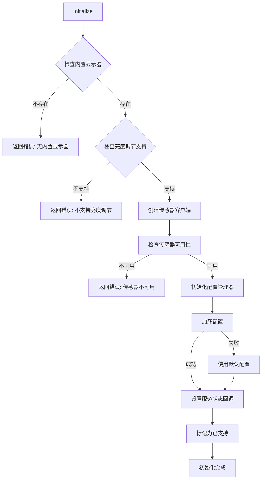
```mermaid
flowchart TD
    A[Initialize] --> B{检查内置显示器}
    B -->|不存在| C[返回错误: 无内置显示器]
    B -->|存在| D{检查亮度调节支持}
    D -->|不支持| E[返回错误: 不支持亮度调节]
    D -->|支持| F[创建传感器客户端]
    F --> G[检查传感器可用性]
    G -->|不可用| H[返回错误: 传感器不可用]
    G -->|可用| I[初始化配置管理器]
    I --> J[加载配置]
    J -->|失败| K[使用默认配置]
    J -->|成功| L[设置服务状态回调]
    K --> L
    L --> M[标记为已支持]
    M --> N[初始化完成]
```

### 5.2 启动流程

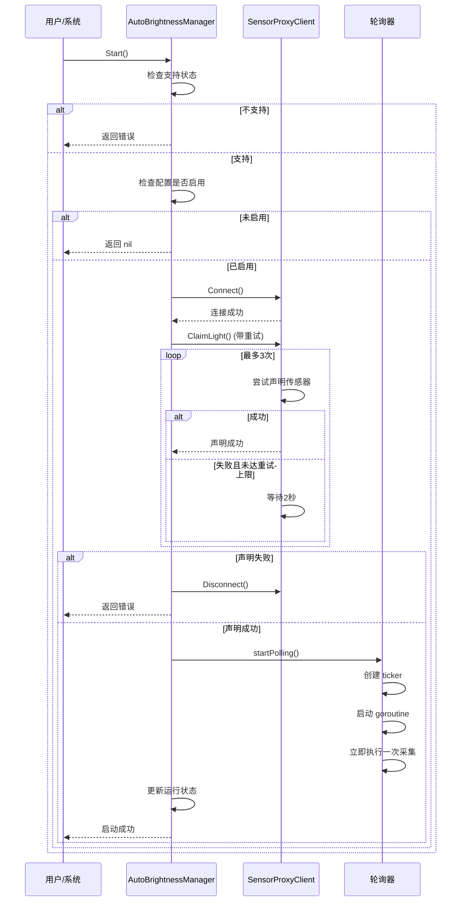
```mermaid
sequenceDiagram
    participant User as 用户/系统
    participant ABM as AutoBrightnessManager
    participant Sensor as SensorProxyClient
    participant Poller as 轮询器

    User->>ABM: Start()
    ABM->>ABM: 检查支持状态
    alt 不支持
        ABM-->>User: 返回错误
    else 支持
        ABM->>ABM: 检查配置是否启用
        alt 未启用
            ABM-->>User: 返回 nil
        else 已启用
            ABM->>Sensor: Connect()
            Sensor-->>ABM: 连接成功
            ABM->>Sensor: ClaimLight() (带重试)
            loop 最多3次
                Sensor->>Sensor: 尝试声明传感器
                alt 成功
                    Sensor-->>ABM: 声明成功
                else 失败且未达重试上限
                    Sensor->>Sensor: 等待2秒
                end
            end
            alt 声明失败
                ABM->>Sensor: Disconnect()
                ABM-->>User: 返回错误
            else 声明成功
                ABM->>Poller: startPolling()
                Poller->>Poller: 创建 ticker
                Poller->>Poller: 启动 goroutine
                Poller->>Poller: 立即执行一次采集
                ABM->>ABM: 更新运行状态
                ABM-->>User: 启动成功
            end
        end
    end
```

### 5.3 轮询流程

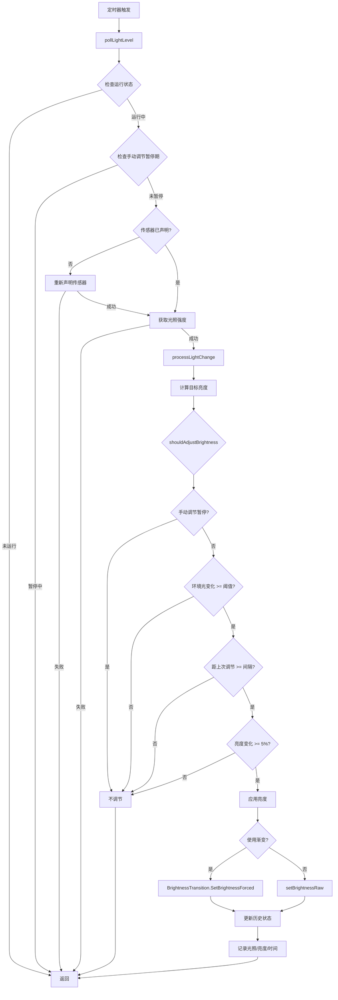
```mermaid
flowchart TD
    A[定时器触发] --> B[pollLightLevel]
    B --> C{检查运行状态}
    C -->|未运行| D[返回]
    C -->|运行中| E{检查手动调节暂停期}
    E -->|暂停中| D
    E -->|未暂停| F{传感器已声明?}
    F -->|否| G[重新声明传感器]
    G -->|失败| D
    G -->|成功| H[获取光照强度]
    F -->|是| H
    H -->|失败| D
    H -->|成功| I[processLightChange]
    
    I --> J[计算目标亮度]
    J --> K{shouldAdjustBrightness}
    
    K --> L{手动调节暂停?}
    L -->|是| M[不调节]
    L -->|否| N{环境光变化 >= 阈值?}
    N -->|否| M
    N -->|是| O{距上次调节 >= 间隔?}
    O -->|否| M
    O -->|是| P{亮度变化 >= 5%?}
    P -->|否| M
    P -->|是| Q[应用亮度]
    
    Q --> R{使用渐变?}
    R -->|是| S[BrightnessTransition.SetBrightnessForced]
    R -->|否| T[setBrightnessRaw]
    S --> U[更新历史状态]
    T --> U
    U --> V[记录光照/亮度/时间]
    V --> D
    M --> D
```

### 5.4 停止流程

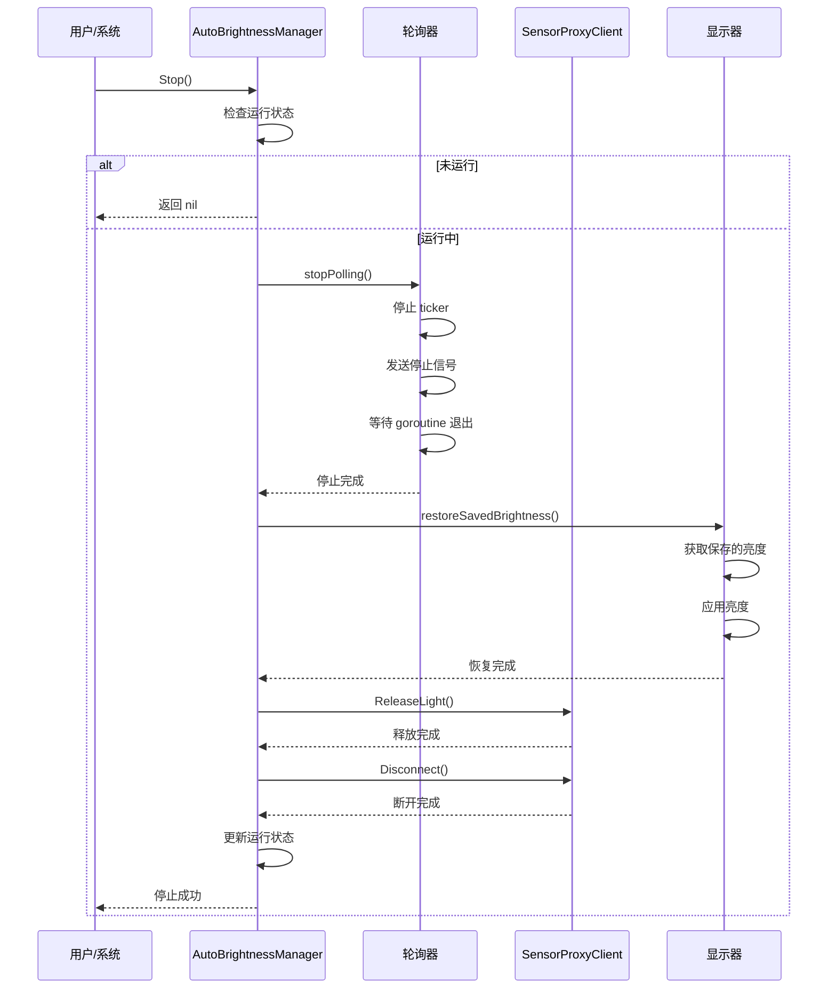
```mermaid
sequenceDiagram
    participant User as 用户/系统
    participant ABM as AutoBrightnessManager
    participant Poller as 轮询器
    participant Sensor as SensorProxyClient
    participant Display as 显示器

    User->>ABM: Stop()
    ABM->>ABM: 检查运行状态
    alt 未运行
        ABM-->>User: 返回 nil
    else 运行中
        ABM->>Poller: stopPolling()
        Poller->>Poller: 停止 ticker
        Poller->>Poller: 发送停止信号
        Poller->>Poller: 等待 goroutine 退出
        Poller-->>ABM: 停止完成
        
        ABM->>Display: restoreSavedBrightness()
        Display->>Display: 获取保存的亮度
        Display->>Display: 应用亮度
        Display-->>ABM: 恢复完成
        
        ABM->>Sensor: ReleaseLight()
        Sensor-->>ABM: 释放完成
        
        ABM->>Sensor: Disconnect()
        Sensor-->>ABM: 断开完成
        
        ABM->>ABM: 更新运行状态
        ABM-->>User: 停止成功
    end
```

## 6. 关键算法

### 6.1 亮度计算算法

```
目标亮度 = min(max((光照强度 × 敏感度) / 255, 0.1), 1.0)
```

**说明：**
- 线性映射：光照强度 0-255 lux → 亮度 0.0-1.0
- 敏感度调整：支持 0.1-3.0 倍率
- 最小亮度保护：不低于 10%，避免屏幕过暗

### 6.2 调节判断逻辑

满足以下所有条件才执行调节：

1. **不在手动调节暂停期**
2. **环境光变化超过阈值**：`|当前光照 - 上次光照| >= ChangeThreshold`
3. **距上次调节时间足够**：`当前时间 - 上次调节时间 >= PollingInterval`
4. **亮度变化足够大**：`|目标亮度 - 当前亮度| >= 5%`

### 6.3 渐变算法

**基本原理：**
将亮度变化分解为多个小步进，在一定时间内逐步完成。

**参数计算：**
```
实际渐变时长 = 配置时长 × |亮度差值|
步进次数 = 实际渐变时长 / 步进间隔
每步变化量 = 亮度差值 / 步进次数
```

**示例：**
- 配置时长：4 秒（0-100% 的时间）
- 步进间隔：100 毫秒
- 亮度变化：30% → 80%（差值 50%）
- 实际时长：4 × 0.5 = 2 秒
- 步进次数：2000ms / 100ms = 20 步
- 每步变化：0.5 / 20 = 0.025 (2.5%)

**优化策略：**
- 最小渐变时长：2 × 步进间隔（避免过短渐变）
- 变化太小时直接设置（< 0.1%）
- 支持中途停止和新渐变覆盖

### 6.4 完整数据流图

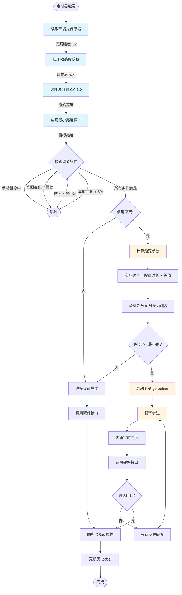
```mermaid
flowchart TB
    Start([定时器触发]) --> A[读取环境光传感器]
    A -->|光照强度 lux| B[应用敏感度系数]
    B -->|调整后光照| C[线性映射到 0.0-1.0]
    C -->|原始亮度| D[应用最小亮度保护]
    D -->|目标亮度| E{检查调节条件}
    
    E -->|手动暂停中| End1([跳过])
    E -->|光照变化 < 阈值| End1
    E -->|时间间隔不足| End1
    E -->|亮度变化 < 5%| End1
    E -->|所有条件满足| F{使用渐变?}
    
    F -->|否| G[直接设置亮度]
    F -->|是| H[计算渐变参数]
    
    H --> I[实际时长 = 配置时长 × 差值]
    I --> J[步进次数 = 时长 / 间隔]
    J --> K{时长 >= 最小值?}
    
    K -->|否| G
    K -->|是| L[启动渐变 goroutine]
    
    L --> M[循环步进]
    M --> N[更新实时亮度]
    N --> O[调用硬件接口]
    O --> P{到达目标?}
    
    P -->|否| Q[等待步进间隔]
    Q --> M
    P -->|是| R[同步 DBus 属性]
    
    G --> S[调用硬件接口]
    S --> R
    
    R --> T[更新历史状态]
    T --> End2([完成])
    
    style A fill:#e1f5ff
    style B fill:#e1f5ff
    style C fill:#e1f5ff
    style D fill:#e1f5ff
    style H fill:#fff4e1
    style L fill:#fff4e1
    style M fill:#fff4e1
```

## 7. 亮度渐变机制

### 7.1 渐变流程

```mermaid
flowchart TD
    A[SetBrightness] --> B{检查启用状态}
    B -->|未启用且非强制| C[直接设置亮度]
    B -->|已启用或强制| D[获取当前亮度]
    
    D --> E{正在渐变?}
    E -->|是| F[使用实时亮度值]
    E -->|否| G[从 Manager 获取]
    
    F --> H[计算亮度差值]
    G --> H
    
    H --> I{差值 < 0.001?}
    I -->|是| J[无需调整,返回]
    I -->|否| K[停止之前的渐变]
    
    K --> L[计算渐变参数]
    L --> M[实际时长 = 配置时长 × |差值|]
    M --> N[步进次数 = 实际时长 / 步进间隔]
    N --> O[每步变化 = 差值 / 步进次数]
    
    O --> P{实际时长 < 最小时长?}
    P -->|是| C
    P -->|否| Q[标记渐变开始]
    
    Q --> R[启动 goroutine]
    R --> S[返回不等待]
    
    R --> T[渐变循环]
    T --> U{收到停止信号?}
    U -->|是| V[更新实时值]
    U -->|否| W[计算下一个亮度]
    
    W --> X[更新实时值]
    X --> Y[setBrightnessRaw]
    Y --> Z{到达目标值?}
    Z -->|是| AA[同步 DBus 属性]
    Z -->|否| AB{最后一步?}
    
    AB -->|否| AC[等待步进间隔或停止信号]
    AC --> U
    AB -->|是| AA
    
    V --> AA
    AA --> AD[标记渐变结束]
    AD --> AE[goroutine 退出]
```

### 7.2 渐变控制

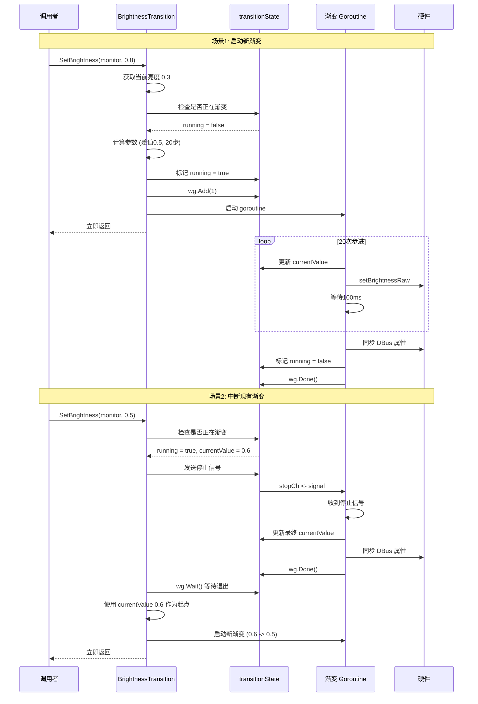
```mermaid
sequenceDiagram
    participant Caller as 调用者
    participant BT as BrightnessTransition
    participant State as transitionState
    participant Worker as 渐变 Goroutine
    participant HW as 硬件

    Note over Caller,HW: 场景1: 启动新渐变
    Caller->>BT: SetBrightness(monitor, 0.8)
    BT->>BT: 获取当前亮度 0.3
    BT->>State: 检查是否正在渐变
    State-->>BT: running = false
    BT->>BT: 计算参数 (差值0.5, 20步)
    BT->>State: 标记 running = true
    BT->>State: wg.Add(1)
    BT->>Worker: 启动 goroutine
    BT-->>Caller: 立即返回
    
    loop 20次步进
        Worker->>State: 更新 currentValue
        Worker->>HW: setBrightnessRaw
        Worker->>Worker: 等待100ms
    end
    Worker->>HW: 同步 DBus 属性
    Worker->>State: 标记 running = false
    Worker->>State: wg.Done()
    
    Note over Caller,HW: 场景2: 中断现有渐变
    Caller->>BT: SetBrightness(monitor, 0.5)
    BT->>State: 检查是否正在渐变
    State-->>BT: running = true, currentValue = 0.6
    BT->>State: 发送停止信号
    State->>Worker: stopCh <- signal
    Worker->>Worker: 收到停止信号
    Worker->>State: 更新最终 currentValue
    Worker->>HW: 同步 DBus 属性
    Worker->>State: wg.Done()
    BT->>State: wg.Wait() 等待退出
    BT->>BT: 使用 currentValue 0.6 作为起点
    BT->>Worker: 启动新渐变 (0.6 -> 0.5)
    BT-->>Caller: 立即返回
```

**启动渐变：**
- 标记 `running = true`
- 增加 WaitGroup 计数
- 启动独立 goroutine 执行

**停止渐变：**
- 发送停止信号到 `stopCh`
- 等待 WaitGroup 完成
- 清空残留信号

**中断处理：**
- 新渐变会先停止旧渐变
- 使用实时亮度值作为起点
- 确保平滑过渡

### 7.3 渐变优化

**性能优化：**
- 每个显示器独立渐变状态
- 非阻塞启动（立即返回）
- 只在完成时同步一次属性

**用户体验优化：**
- 变化太小时直接设置（< 0.1%）
- 渐变时长按比例缩放
- 最小渐变时长保护（200ms）

**资源管理：**
- 使用 WaitGroup 确保 goroutine 正确退出
- 停止信号使用缓冲通道避免阻塞
- 清理残留信号防止误触发

### 7.4 自动亮度与渐变集成

**两种调用方式：**

1. **SetBrightness（常规）**
   - 检查全局 `enabled` 标志
   - 未启用时直接设置亮度

2. **SetBrightnessForced（强制）**
   - 忽略全局 `enabled` 标志
   - 自动亮度专用，确保渐变生效

**配置独立性：**
- 自动亮度有独立的 `UseTransition` 配置
- 可以在全局渐变关闭时仍使用渐变
- 通过 `SetBrightnessForced` 实现

**属性同步：**
- 渐变过程中不同步属性（减少信号）
- 只在渐变完成或停止时同步一次
- 失败时立即同步确保一致性

## 8. 手动调节处理

### 8.1 两种模式

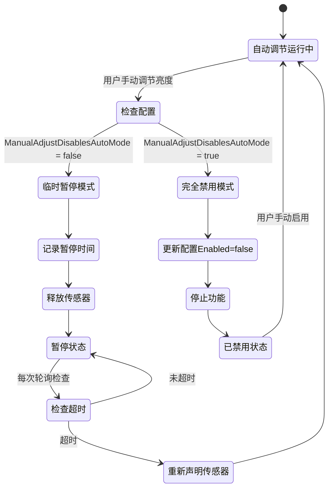
```mermaid
stateDiagram-v2
    [*] --> 自动调节运行中
    
    自动调节运行中 --> 检查配置: 用户手动调节亮度
    
    检查配置 --> 临时暂停模式: ManualAdjustDisablesAutoMode = false
    检查配置 --> 完全禁用模式: ManualAdjustDisablesAutoMode = true
    
    临时暂停模式 --> 记录暂停时间
    记录暂停时间 --> 释放传感器
    释放传感器 --> 暂停状态
    
    暂停状态 --> 检查超时: 每次轮询检查
    检查超时 --> 暂停状态: 未超时
    检查超时 --> 重新声明传感器: 超时
    重新声明传感器 --> 自动调节运行中
    
    完全禁用模式 --> 更新配置Enabled=false
    更新配置Enabled=false --> 停止功能
    停止功能 --> 已禁用状态
    
    已禁用状态 --> 自动调节运行中: 用户手动启用
```

**模式一：临时暂停（默认）**
- 手动调节后暂停自动调节指定时间
- 暂停期间释放传感器资源
- 超时后自动恢复

**模式二：完全禁用**
- 手动调节后永久禁用自动亮度
- 更新配置并停止功能
- 需用户手动重新启用

### 8.2 手动调节处理时序

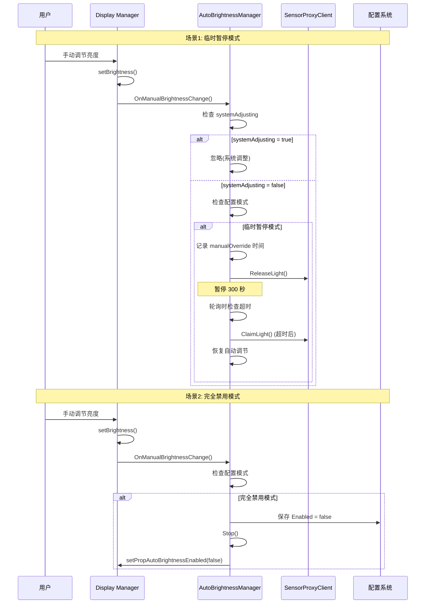
```mermaid
sequenceDiagram
    participant User as 用户
    participant Manager as Display Manager
    participant ABM as AutoBrightnessManager
    participant Sensor as SensorProxyClient
    participant Config as 配置系统

    Note over User,Config: 场景1: 临时暂停模式
    User->>Manager: 手动调节亮度
    Manager->>Manager: setBrightness()
    Manager->>ABM: OnManualBrightnessChange()
    ABM->>ABM: 检查 systemAdjusting
    alt systemAdjusting = true
        ABM->>ABM: 忽略(系统调整)
    else systemAdjusting = false
        ABM->>ABM: 检查配置模式
        alt 临时暂停模式
            ABM->>ABM: 记录 manualOverride 时间
            ABM->>Sensor: ReleaseLight()
            Note over ABM: 暂停 300 秒
            ABM->>ABM: 轮询时检查超时
            ABM->>Sensor: ClaimLight() (超时后)
            ABM->>ABM: 恢复自动调节
        end
    end

    Note over User,Config: 场景2: 完全禁用模式
    User->>Manager: 手动调节亮度
    Manager->>Manager: setBrightness()
    Manager->>ABM: OnManualBrightnessChange()
    ABM->>ABM: 检查配置模式
    alt 完全禁用模式
        ABM->>Config: 保存 Enabled = false
        ABM->>ABM: Stop()
        ABM->>Manager: setPropAutoBrightnessEnabled(false)
    end
```

### 8.3 系统调整标志

通过 `systemAdjusting` 标志区分系统自动调整（如节能模式）和用户手动调整，避免误判。

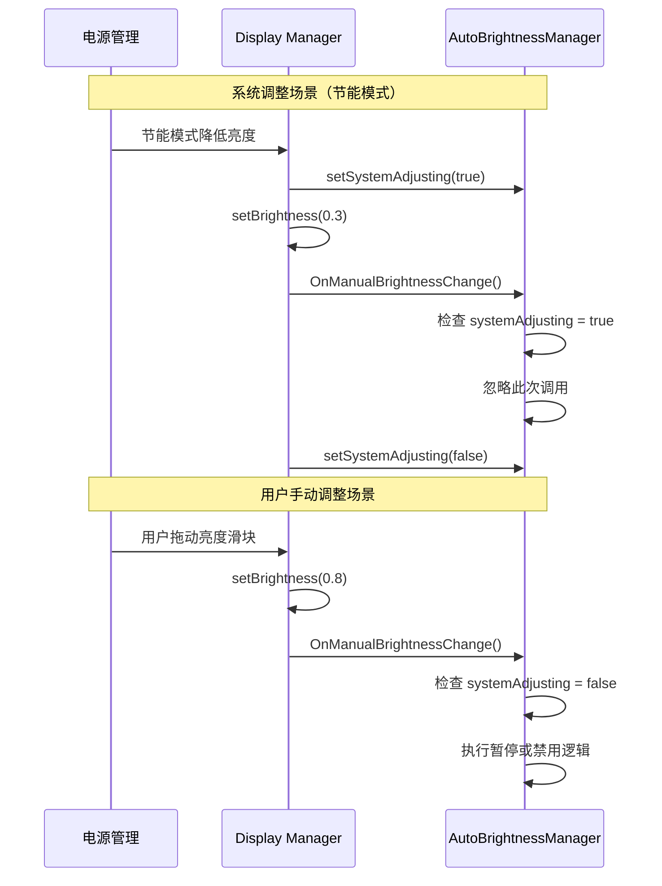
```mermaid
sequenceDiagram
    participant Power as 电源管理
    participant Manager as Display Manager
    participant ABM as AutoBrightnessManager

    Note over Power,ABM: 系统调整场景（节能模式）
    Power->>Manager: 节能模式降低亮度
    Manager->>ABM: setSystemAdjusting(true)
    Manager->>Manager: setBrightness(0.3)
    Manager->>ABM: OnManualBrightnessChange()
    ABM->>ABM: 检查 systemAdjusting = true
    ABM->>ABM: 忽略此次调用
    Manager->>ABM: setSystemAdjusting(false)
    
    Note over Power,ABM: 用户手动调整场景
    Power->>Manager: 用户拖动亮度滑块
    Manager->>Manager: setBrightness(0.8)
    Manager->>ABM: OnManualBrightnessChange()
    ABM->>ABM: 检查 systemAdjusting = false
    ABM->>ABM: 执行暂停或禁用逻辑
```

## 9. 配置管理

### 9.1 DSettings 集成

- **AppID:** `org.deepin.startdde`
- **配置名:** `org.deepin.startdde.display`
- **配置键前缀:** `autobrightness-*`

### 9.2 配置项

**自动亮度配置：**

| 配置键 | 类型 | 默认值 | 说明 |
|--------|------|--------|------|
| enabled | bool | false | 是否启用 |
| sensitivity | float64 | 0.5 | 敏感度 |
| polling-interval | int | 3 | 轮询间隔(秒) |
| change-threshold | float64 | 20.0 | 变化阈值 |
| manual-override-duration | int | 300 | 手动暂停时间(秒) |
| manual-adjust-disables-auto-mode | bool | true | 手动调节是否禁用 |
| use-transition | bool | true | 是否使用渐变 |

**渐变效果配置：**

| 配置键 | 类型 | 默认值 | 说明 |
|--------|------|--------|------|
| transition-enabled | bool | true | 全局渐变开关 |
| transition-duration | int | 4 | 0-100% 渐变时长(秒) |
| transition-step-interval | int | 100 | 步进间隔(毫秒) |

### 9.3 动态更新

监听配置文件变化，自动重新加载并应用新配置。敏感度变化时立即触发一次亮度调整。

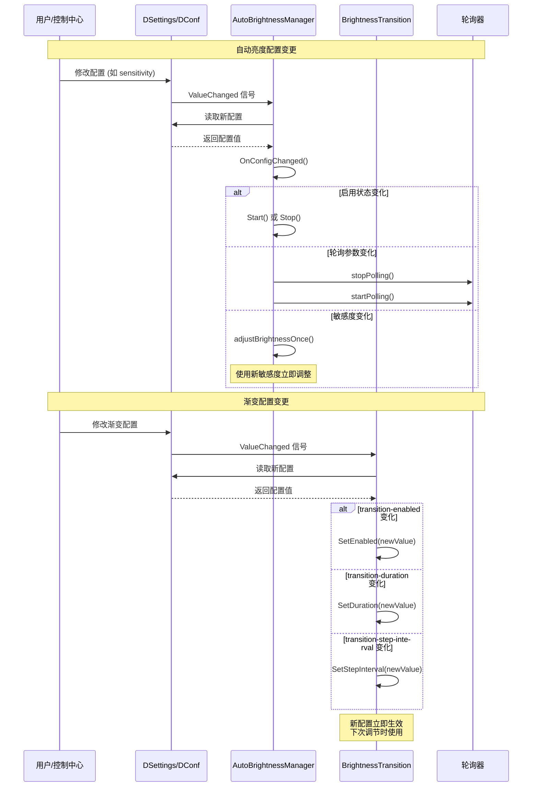
```mermaid
sequenceDiagram
    participant User as 用户/控制中心
    participant DConf as DSettings/DConf
    participant ABM as AutoBrightnessManager
    participant BT as BrightnessTransition
    participant Poller as 轮询器

    Note over User,Poller: 自动亮度配置变更
    User->>DConf: 修改配置 (如 sensitivity)
    DConf->>ABM: ValueChanged 信号
    ABM->>DConf: 读取新配置
    DConf-->>ABM: 返回配置值
    ABM->>ABM: OnConfigChanged()
    
    alt 启用状态变化
        ABM->>ABM: Start() 或 Stop()
    else 轮询参数变化
        ABM->>Poller: stopPolling()
        ABM->>Poller: startPolling()
    else 敏感度变化
        ABM->>ABM: adjustBrightnessOnce()
        Note over ABM: 使用新敏感度立即调整
    end
    
    Note over User,Poller: 渐变配置变更
    User->>DConf: 修改渐变配置
    DConf->>BT: ValueChanged 信号
    BT->>DConf: 读取新配置
    DConf-->>BT: 返回配置值
    
    alt transition-enabled 变化
        BT->>BT: SetEnabled(newValue)
    else transition-duration 变化
        BT->>BT: SetDuration(newValue)
    else transition-step-interval 变化
        BT->>BT: SetStepInterval(newValue)
    end
    
    Note over BT: 新配置立即生效<br/>下次调节时使用
```

## 10. 异常处理

### 10.1 重试机制

- 传感器声明失败：最多重试 3 次，间隔 2 秒
- 亮度设置失败：下次轮询自动重试

### 10.2 优雅降级

- 传感器服务不可用：停止功能但不崩溃
- 配置加载失败：使用默认配置
- 内置显示器不存在：标记为不支持

### 10.3 服务恢复

监听 iio-sensor-proxy 服务状态，服务恢复后自动重新初始化。

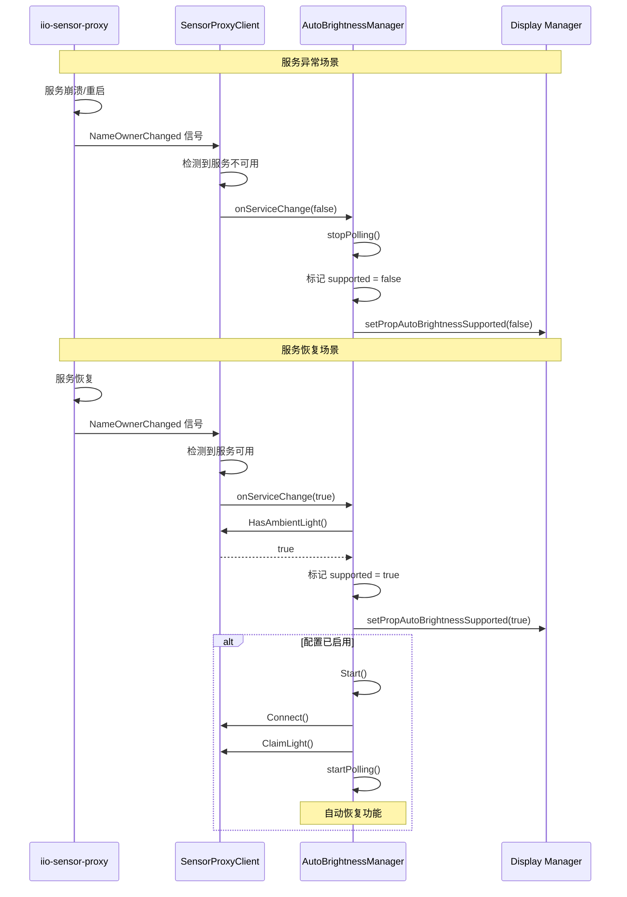
```mermaid
sequenceDiagram
    participant Sensor as iio-sensor-proxy
    participant Client as SensorProxyClient
    participant ABM as AutoBrightnessManager
    participant Manager as Display Manager

    Note over Sensor,Manager: 服务异常场景
    Sensor->>Sensor: 服务崩溃/重启
    Sensor->>Client: NameOwnerChanged 信号
    Client->>Client: 检测到服务不可用
    Client->>ABM: onServiceChange(false)
    ABM->>ABM: stopPolling()
    ABM->>ABM: 标记 supported = false
    ABM->>Manager: setPropAutoBrightnessSupported(false)
    
    Note over Sensor,Manager: 服务恢复场景
    Sensor->>Sensor: 服务恢复
    Sensor->>Client: NameOwnerChanged 信号
    Client->>Client: 检测到服务可用
    Client->>ABM: onServiceChange(true)
    ABM->>Client: HasAmbientLight()
    Client-->>ABM: true
    ABM->>ABM: 标记 supported = true
    ABM->>Manager: setPropAutoBrightnessSupported(true)
    
    alt 配置已启用
        ABM->>ABM: Start()
        ABM->>Client: Connect()
        ABM->>Client: ClaimLight()
        ABM->>ABM: startPolling()
        Note over ABM: 自动恢复功能
    end
```

## 11. 并发控制

### 11.1 锁策略

- 使用 `sync.RWMutex` 保护共享状态
- 读多写少场景使用读锁
- 避免在持有锁时执行耗时操作

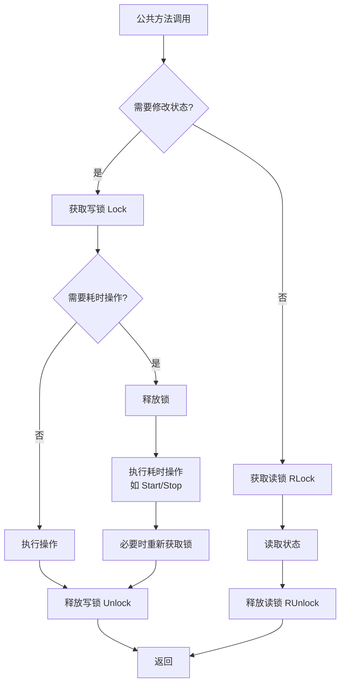
```mermaid
graph TD
    A[公共方法调用] --> B{需要修改状态?}
    B -->|是| C[获取写锁 Lock]
    B -->|否| D[获取读锁 RLock]
    
    C --> E{需要耗时操作?}
    E -->|是| F[释放锁]
    E -->|否| G[执行操作]
    
    F --> H[执行耗时操作<br/>如 Start/Stop]
    H --> I[必要时重新获取锁]
    
    G --> J[释放写锁 Unlock]
    D --> K[读取状态]
    K --> L[释放读锁 RUnlock]
    
    I --> J
    J --> M[返回]
    L --> M
```

### 11.2 Goroutine 管理

- 轮询 goroutine：通过 `stopChan` 和 `WaitGroup` 安全退出
- 配置更新回调：异步执行，避免阻塞
- 幂等停止：`stopPolling()` 可安全多次调用

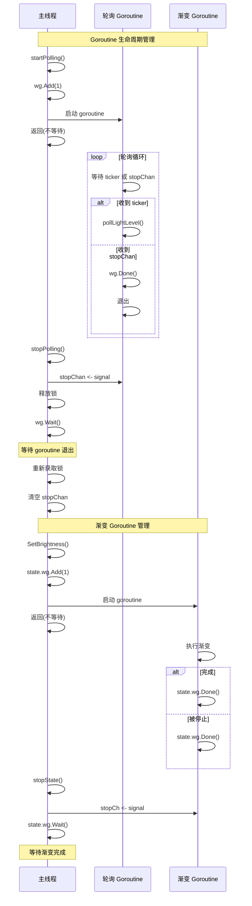
```mermaid
sequenceDiagram
    participant Main as 主线程
    participant Poller as 轮询 Goroutine
    participant Worker as 渐变 Goroutine

    Note over Main,Worker: Goroutine 生命周期管理
    
    Main->>Main: startPolling()
    Main->>Main: wg.Add(1)
    Main->>Poller: 启动 goroutine
    Main->>Main: 返回(不等待)
    
    loop 轮询循环
        Poller->>Poller: 等待 ticker 或 stopChan
        alt 收到 ticker
            Poller->>Poller: pollLightLevel()
        else 收到 stopChan
            Poller->>Poller: wg.Done()
            Poller->>Poller: 退出
        end
    end
    
    Main->>Main: stopPolling()
    Main->>Poller: stopChan <- signal
    Main->>Main: 释放锁
    Main->>Main: wg.Wait()
    Note over Main: 等待 goroutine 退出
    Main->>Main: 重新获取锁
    Main->>Main: 清空 stopChan
    
    Note over Main,Worker: 渐变 Goroutine 管理
    Main->>Main: SetBrightness()
    Main->>Main: state.wg.Add(1)
    Main->>Worker: 启动 goroutine
    Main->>Main: 返回(不等待)
    
    Worker->>Worker: 执行渐变
    alt 完成
        Worker->>Worker: state.wg.Done()
    else 被停止
        Worker->>Worker: state.wg.Done()
    end
    
    Main->>Main: stopState()
    Main->>Worker: stopCh <- signal
    Main->>Main: state.wg.Wait()
    Note over Main: 等待渐变完成
```

## 12. 系统集成

### 12.1 与 Display Manager 集成

- 复用 Manager 的显示器管理能力
- 复用 BrightnessTransition 渐变功能
- 同步更新 DBus 属性

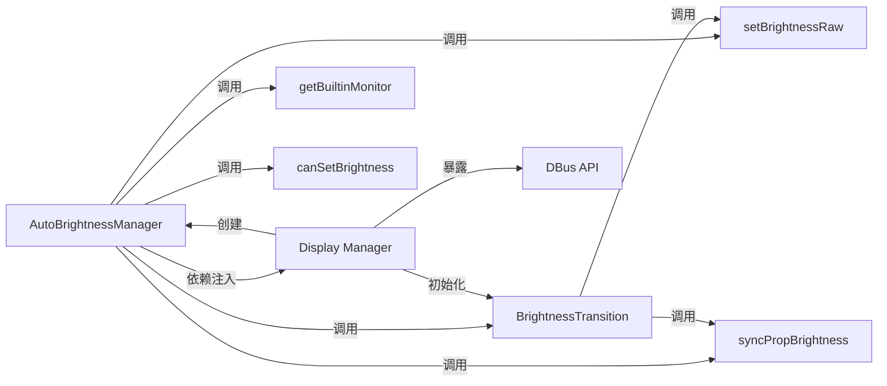
```mermaid
graph LR
    ABM[AutoBrightnessManager] -->|依赖注入| Manager[Display Manager]
    ABM -->|调用| BT[BrightnessTransition]
    ABM -->|调用| getBuiltinMonitor
    ABM -->|调用| canSetBrightness
    ABM -->|调用| setBrightnessRaw
    ABM -->|调用| syncPropBrightness
    
    Manager -->|创建| ABM
    Manager -->|初始化| BT
    Manager -->|暴露| DBusAPI[DBus API]
    
    BT -->|调用| setBrightnessRaw
    BT -->|调用| syncPropBrightness
```

### 12.2 电源管理集成

- 支持系统休眠/唤醒事件
- `hold()`: 休眠前暂停轮询
- `resume()`: 唤醒后恢复轮询

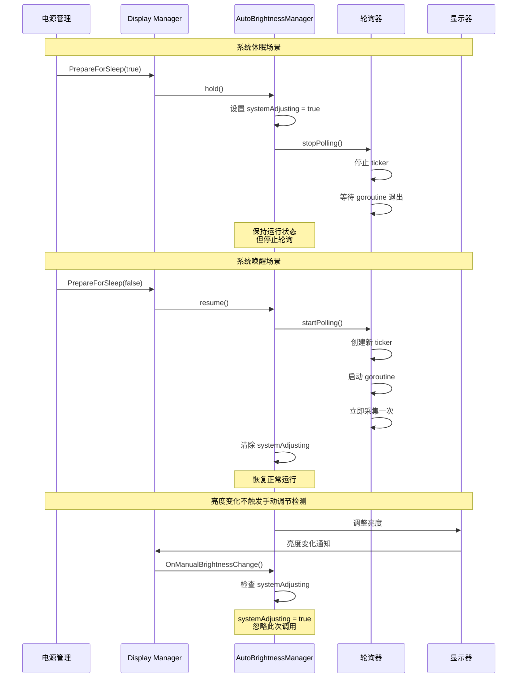
```mermaid
sequenceDiagram
    participant PM as 电源管理
    participant Manager as Display Manager
    participant ABM as AutoBrightnessManager
    participant Poller as 轮询器
    participant Display as 显示器

    Note over PM,Display: 系统休眠场景
    PM->>Manager: PrepareForSleep(true)
    Manager->>ABM: hold()
    ABM->>ABM: 设置 systemAdjusting = true
    ABM->>Poller: stopPolling()
    Poller->>Poller: 停止 ticker
    Poller->>Poller: 等待 goroutine 退出
    Note over ABM: 保持运行状态<br/>但停止轮询
    
    Note over PM,Display: 系统唤醒场景
    PM->>Manager: PrepareForSleep(false)
    Manager->>ABM: resume()
    ABM->>Poller: startPolling()
    Poller->>Poller: 创建新 ticker
    Poller->>Poller: 启动 goroutine
    Poller->>Poller: 立即采集一次
    ABM->>ABM: 清除 systemAdjusting
    Note over ABM: 恢复正常运行
    
    Note over PM,Display: 亮度变化不触发手动调节检测
    ABM->>Display: 调整亮度
    Display->>Manager: 亮度变化通知
    Manager->>ABM: OnManualBrightnessChange()
    ABM->>ABM: 检查 systemAdjusting
    Note over ABM: systemAdjusting = true<br/>忽略此次调用
```

### 12.3 DBus 接口

通过 Manager 暴露以下属性和方法：
- `AutoBrightnessSupported` (只读)
- `AutoBrightnessEnabled` (读写)
- 配置相关的 Get/Set 方法

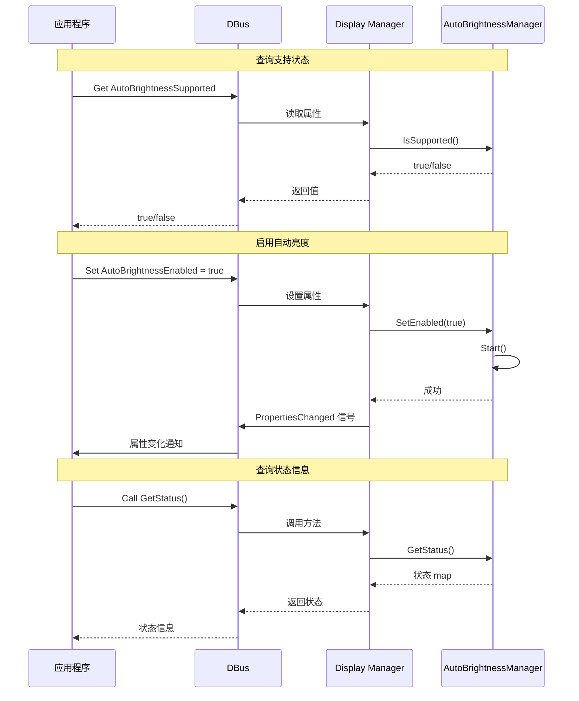
```mermaid
sequenceDiagram
    participant App as 应用程序
    participant DBus as DBus
    participant Manager as Display Manager
    participant ABM as AutoBrightnessManager

    Note over App,ABM: 查询支持状态
    App->>DBus: Get AutoBrightnessSupported
    DBus->>Manager: 读取属性
    Manager->>ABM: IsSupported()
    ABM-->>Manager: true/false
    Manager-->>DBus: 返回值
    DBus-->>App: true/false
    
    Note over App,ABM: 启用自动亮度
    App->>DBus: Set AutoBrightnessEnabled = true
    DBus->>Manager: 设置属性
    Manager->>ABM: SetEnabled(true)
    ABM->>ABM: Start()
    ABM-->>Manager: 成功
    Manager->>DBus: PropertiesChanged 信号
    DBus->>App: 属性变化通知
    
    Note over App,ABM: 查询状态信息
    App->>DBus: Call GetStatus()
    DBus->>Manager: 调用方法
    Manager->>ABM: GetStatus()
    ABM-->>Manager: 状态 map
    Manager-->>DBus: 返回状态
    DBus-->>App: 状态信息
```

## 13. 依赖关系

### 13.1 外部依赖

- **iio-sensor-proxy:** 提供环境光传感器数据
- **DSettings/DConfig:** 配置管理
- **DBus:** 进程间通信

### 13.2 内部依赖

- **display.Manager:** 显示器管理和亮度控制
- **BrightnessTransition:** 亮度渐变效果
- **backlight:** 底层亮度控制

## 14. 测试要点

### 14.1 功能测试

- 基本启停流程
- 配置加载和保存
- 亮度计算准确性
- 手动调节处理

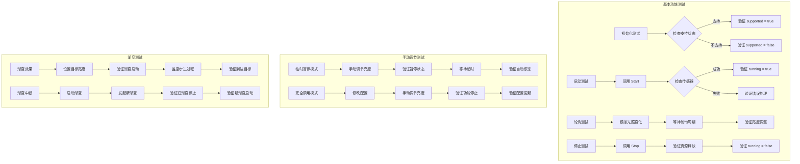
```mermaid
graph TD
    subgraph "基本功能测试"
        T1[初始化测试] --> T1A{检查支持状态}
        T1A -->|支持| T1B[验证 supported = true]
        T1A -->|不支持| T1C[验证 supported = false]
        
        T2[启动测试] --> T2A[调用 Start]
        T2A --> T2B{检查传感器}
        T2B -->|成功| T2C[验证 running = true]
        T2B -->|失败| T2D[验证错误处理]
        
        T3[轮询测试] --> T3A[模拟光照变化]
        T3A --> T3B[等待轮询周期]
        T3B --> T3C[验证亮度调整]
        
        T4[停止测试] --> T4A[调用 Stop]
        T4A --> T4B[验证资源释放]
        T4B --> T4C[验证 running = false]
    end
    
    subgraph "手动调节测试"
        T5[临时暂停模式] --> T5A[手动调节亮度]
        T5A --> T5B[验证暂停状态]
        T5B --> T5C[等待超时]
        T5C --> T5D[验证自动恢复]
        
        T6[完全禁用模式] --> T6A[修改配置]
        T6A --> T6B[手动调节亮度]
        T6B --> T6C[验证功能停止]
        T6C --> T6D[验证配置更新]
    end
    
    subgraph "渐变测试"
        T7[渐变效果] --> T7A[设置目标亮度]
        T7A --> T7B[验证渐变启动]
        T7B --> T7C[监控步进过程]
        T7C --> T7D[验证到达目标]
        
        T8[渐变中断] --> T8A[启动渐变]
        T8A --> T8B[发起新渐变]
        T8B --> T8C[验证旧渐变停止]
        T8C --> T8D[验证新渐变启动]
    end
```

### 14.2 异常测试

- 传感器服务不可用
- 配置文件损坏
- 并发访问
- 资源泄漏

```mermaid
graph TD
    subgraph "异常场景测试"
        E1[传感器服务异常] --> E1A[停止 iio-sensor-proxy]
        E1A --> E1B[验证服务不可用检测]
        E1B --> E1C[验证优雅降级]
        E1C --> E1D[重启服务]
        E1D --> E1E[验证自动恢复]
        
        E2[配置异常] --> E2A[损坏配置文件]
        E2A --> E2B[尝试加载配置]
        E2B --> E2C[验证使用默认配置]
        
        E3[并发测试] --> E3A[多线程调用]
        E3A --> E3B[验证无死锁]
        E3B --> E3C[验证数据一致性]
        
        E4[资源泄漏] --> E4A[反复启停]
        E4A --> E4B[监控 goroutine 数量]
        E4B --> E4C[监控内存使用]
        E4C --> E4D[验证资源正确释放]
    end
    
    subgraph "边界条件测试"
        B1[极端光照值] --> B1A[测试 0 lux]
        B1A --> B1B[测试 255 lux]
        B1B --> B1C[测试超出范围值]
        
        B2[极端配置] --> B2A[最小轮询间隔]
        B2A --> B2B[最大敏感度]
        B2B --> B2C[最小阈值]
        
        B3[快速变化] --> B3A[光照快速波动]
        B3A --> B3B[验证防抖动]
        B3B --> B3C[验证调节频率限制]
    end
```

### 14.3 性能测试

- CPU 占用率
- 内存使用
- 响应延迟
- 长时间运行稳定性

```mermaid
graph LR
    subgraph "性能指标"
        P1[CPU 占用] --> P1A[空闲时 < 0.5%]
        P1A --> P1B[调节时 < 2%]
        
        P2[内存使用] --> P2A[基础内存 < 5MB]
        P2A --> P2B[无内存泄漏]
        
        P3[响应延迟] --> P3A[光照变化到调节 < 5s]
        P3A --> P3B[配置变更生效 < 1s]
        
        P4[稳定性] --> P4A[24小时运行测试]
        P4A --> P4B[无崩溃无异常]
    end
    
    subgraph "压力测试"
        S1[高频调节] --> S1A[每秒变化光照]
        S1A --> S1B[验证系统稳定]
        
        S2[长时间运行] --> S2A[连续运行7天]
        S2A --> S2B[监控资源使用]
        S2B --> S2C[验证无退化]
        
        S3[并发压力] --> S3A[多线程频繁调用]
        S3A --> S3B[验证锁性能]
        S3B --> S3C[验证无竞争条件]
    end
```

## 15. 未来扩展

### 15.1 算法优化

- 支持非线性亮度曲线
- 机器学习自适应调节
- 时间段相关的亮度策略

### 15.2 功能增强

- 多显示器独立控制
- 色温自动调节
- 用户习惯学习

### 15.3 性能优化

- 事件驱动替代轮询
- 智能采样频率调整
- 更精细的电源管理

## 16. 典型使用场景

### 16.1 场景一：用户启用自动亮度

```mermaid
sequenceDiagram
    participant User as 用户
    participant CC as 控制中心
    participant Manager as Display Manager
    participant ABM as AutoBrightnessManager
    participant Sensor as 传感器
    participant Display as 显示器

    User->>CC: 打开自动亮度开关
    CC->>Manager: SetAutoBrightnessEnabled(true)
    Manager->>ABM: SetEnabled(true)
    ABM->>ABM: 保存配置
    ABM->>ABM: Start()
    ABM->>Sensor: 连接并声明传感器
    Sensor-->>ABM: 成功
    ABM->>ABM: 启动轮询
    
    loop 每3秒
        ABM->>Sensor: 读取光照强度
        Sensor-->>ABM: 150 lux
        ABM->>ABM: 计算目标亮度 58%
        ABM->>Display: 渐变调整到 58%
        Display->>Display: 平滑过渡
    end
    
    Manager->>CC: PropertiesChanged
    CC->>User: 显示已启用状态
```

### 16.2 场景二：环境光变化触发调节

```mermaid
sequenceDiagram
    participant Env as 环境
    participant Sensor as 传感器
    participant ABM as AutoBrightnessManager
    participant Display as 显示器
    participant User as 用户

    Note over Env: 室内光线变暗
    Env->>Sensor: 光照从 200 lux 降至 50 lux
    
    ABM->>Sensor: 轮询读取
    Sensor-->>ABM: 50 lux
    ABM->>ABM: 计算目标亮度
    Note over ABM: 当前 78% -> 目标 29%<br/>变化 49% > 阈值 20%
    
    ABM->>ABM: shouldAdjustBrightness()
    ABM->>ABM: 所有条件满足
    
    ABM->>Display: SetBrightnessForced(0.29)
    Note over Display: 启动渐变<br/>2秒内从 78% -> 29%
    
    loop 20步，每步100ms
        Display->>Display: 亮度 -= 2.45%
    end
    
    Display->>User: 屏幕亮度平滑降低
    Note over User: 感觉舒适，无闪烁
```

### 16.3 场景三：手动调节后的行为

```mermaid
sequenceDiagram
    participant User as 用户
    participant CC as 控制中心
    participant Manager as Display Manager
    participant ABM as AutoBrightnessManager
    participant Sensor as 传感器

    Note over ABM: 自动亮度运行中
    
    User->>CC: 手动拖动亮度滑块到 90%
    CC->>Manager: SetBrightness(0.9)
    Manager->>Manager: setBrightness()
    Manager->>ABM: OnManualBrightnessChange()
    
    alt 临时暂停模式
        ABM->>ABM: 记录暂停时间
        ABM->>Sensor: ReleaseLight()
        Note over ABM: 暂停 300 秒
        
        Note over ABM,Sensor: 5分钟后
        ABM->>ABM: 检查超时
        ABM->>Sensor: ClaimLight()
        ABM->>ABM: 恢复自动调节
        Note over User: 自动亮度重新生效
        
    else 完全禁用模式
        ABM->>ABM: 保存 Enabled = false
        ABM->>ABM: Stop()
        ABM->>Sensor: 释放并断开
        Manager->>CC: PropertiesChanged
        CC->>User: 显示已禁用状态
        Note over User: 需手动重新启用
    end
```

### 16.4 场景四：系统休眠与唤醒

```mermaid
sequenceDiagram
    participant PM as 电源管理
    participant Manager as Display Manager
    participant ABM as AutoBrightnessManager
    participant Sensor as 传感器
    participant Display as 显示器

    Note over PM: 用户合上笔记本
    PM->>Manager: PrepareForSleep(true)
    Manager->>ABM: hold()
    ABM->>ABM: systemAdjusting = true
    ABM->>ABM: stopPolling()
    Note over ABM: 保持连接但停止轮询
    
    Note over PM: 系统休眠...
    
    Note over PM: 用户打开笔记本
    PM->>Manager: PrepareForSleep(false)
    Manager->>ABM: resume()
    ABM->>ABM: startPolling()
    ABM->>Sensor: 立即读取光照
    Sensor-->>ABM: 当前光照值
    ABM->>Display: 调整到合适亮度
    ABM->>ABM: systemAdjusting = false
    Note over ABM: 恢复正常运行
```

## 17. 注意事项

1. **线程安全：** 所有公共方法都需要考虑并发访问
2. **资源管理：** 确保传感器资源正确释放
3. **用户体验：** 避免频繁调节造成闪烁
4. **电源效率：** 合理设置轮询间隔
5. **降级策略：** 功能不可用时不影响系统稳定性

