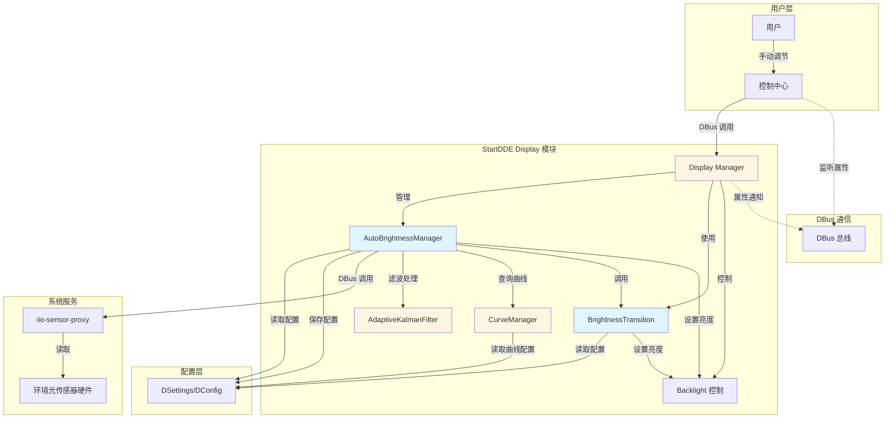
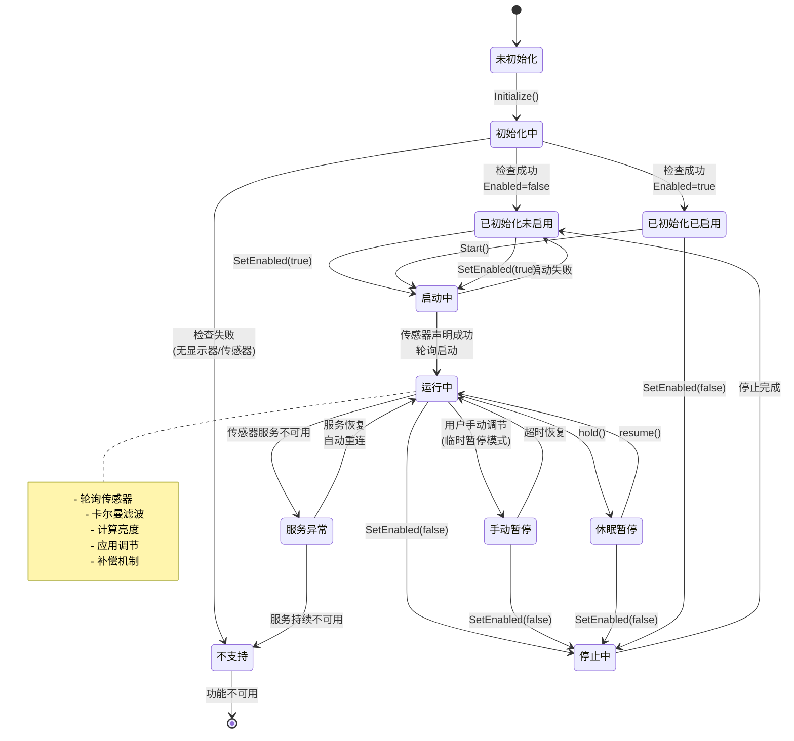
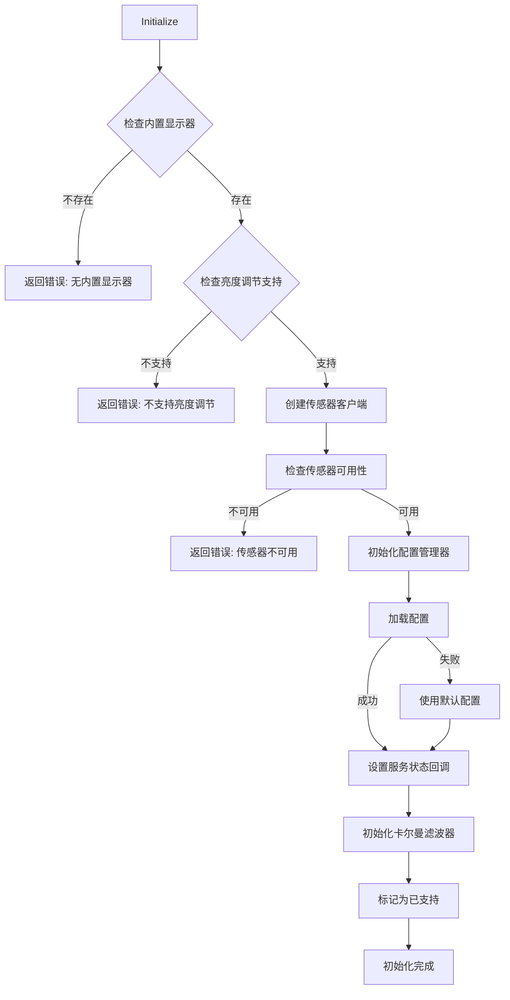
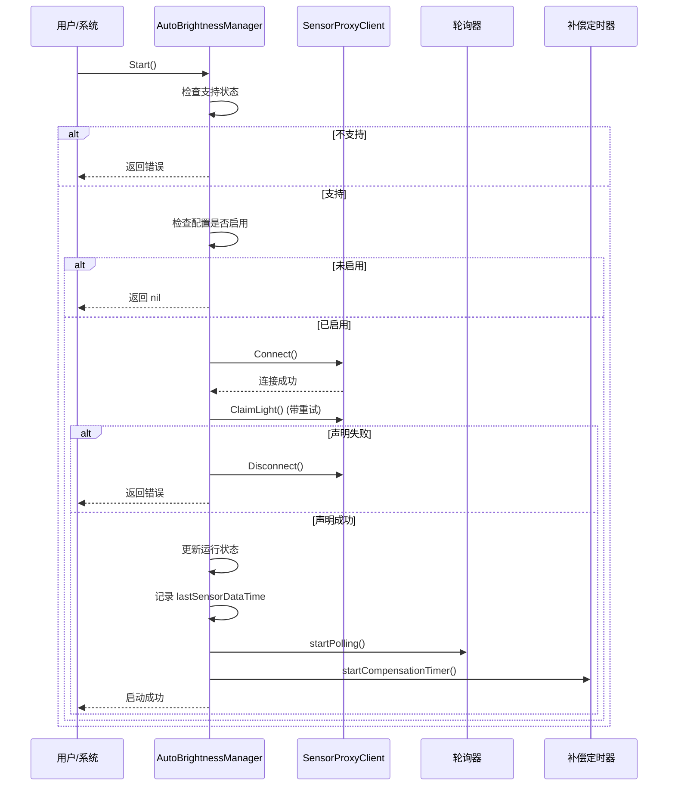
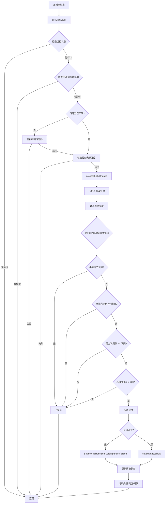
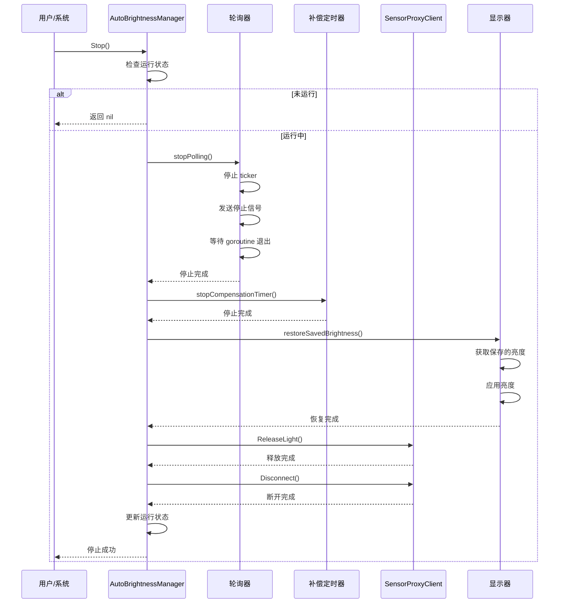
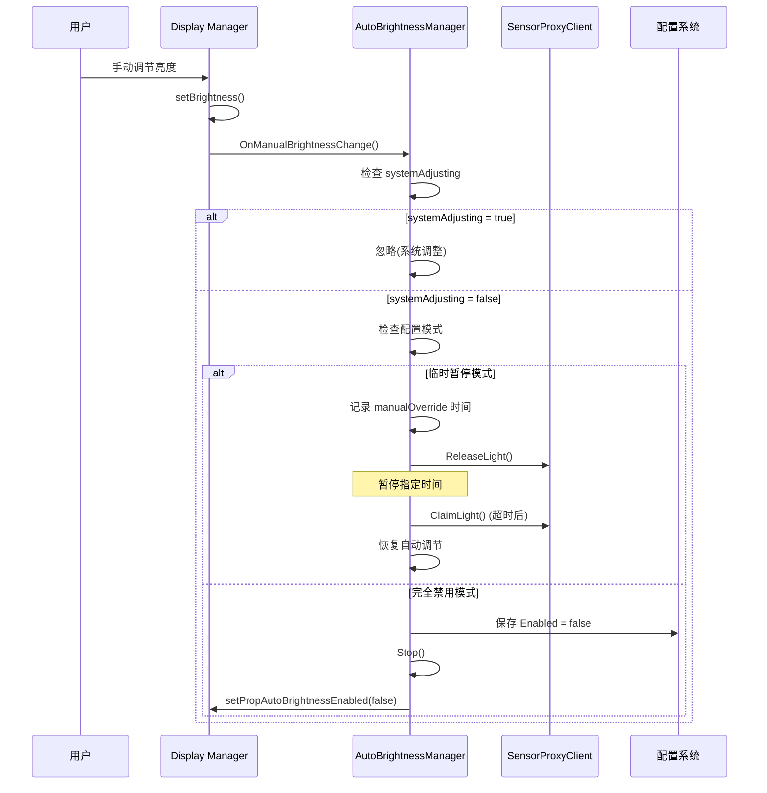

# 自动亮度调节功能概要设计文档

## 目录

1. [功能概述](#1-功能概述)
   - 1.1 系统架构图
2. [核心组件](#2-核心组件)
   - 2.1 AutoBrightnessManager
   - 2.2 SensorProxyClient
   - 2.3 BrightnessTransition
   - 2.4 CurveManager
   - 2.5 配置管理
3. [状态机](#3-状态机)
   - 3.1 自动亮度状态转换
4. [数据结构](#4-数据结构)
   - 4.1 AutoBrightnessConfig
   - 4.2 AutoBrightnessManager 状态字段
   - 4.3 BrightnessTransition 数据结构
5. [核心流程](#5-核心流程)
   - 5.1 初始化流程
   - 5.2 启动流程
   - 5.3 轮询流程
   - 5.4 停止流程
6. [关键算法](#6-关键算法)
   - 6.1 亮度计算算法
   - 6.2 卡尔曼滤波器
   - 6.3 调节判断逻辑
   - 6.4 渐变算法
   - 6.5 补偿机制
7. [亮度渐变机制](#7-亮度渐变机制)
   - 7.1 渐变流程
   - 7.2 渐变控制
   - 7.3 渐变优化
8. [手动调节处理](#8-手动调节处理)
   - 8.1 两种模式
   - 8.2 手动调节处理时序
   - 8.3 系统调整标志
9. [配置管理](#9-配置管理)
   - 9.1 DSettings 集成
   - 9.2 配置项
   - 9.3 动态更新
10. [异常处理](#10-异常处理)
    - 10.1 重试机制
    - 10.2 优雅降级
    - 10.3 服务恢复
11. [并发控制](#11-并发控制)
    - 11.1 锁策略
    - 11.2 Goroutine 管理
12. [系统集成](#12-系统集成)
    - 12.1 与 Display Manager 集成
    - 12.2 电源管理集成
    - 12.3 DBus 接口
13. [依赖关系](#13-依赖关系)
    - 13.1 外部依赖
    - 13.2 内部依赖
14. [测试要点](#14-测试要点)
15. [注意事项](#15-注意事项)

---

## 1. 功能概述

自动亮度调节功能通过环境光传感器自动调整显示器亮度，提升用户体验并节省电能。该功能集成在 StartDDE 的 display 模块中，支持灵活的配置和优雅的降级处理。

### 1.1 系统架构图



## 2. 核心组件

### 2.1 AutoBrightnessManager

自动亮度管理器，负责整个功能的生命周期管理。

**主要职责：**
- 初始化和资源管理
- 配置加载和持久化
- 传感器数据采集和滤波处理
- 亮度计算和应用
- 状态监控和异常处理
- 补偿机制管理

### 2.2 SensorProxyClient

传感器代理客户端，封装与 iio-sensor-proxy 服务的交互。

**主要功能：**
- 连接/断开传感器服务
- 声明/释放环境光传感器
- 读取光照强度数据（原始值缓存）
- 监听服务状态变化
- 监听光照值变化（推送模式）

### 2.3 BrightnessTransition

亮度渐变管理器，提供平滑的亮度过渡效果。

**主要功能：**
- 渐变效果的启用/禁用控制
- 渐变参数配置（时长、步进间隔）
- 多显示器独立渐变状态管理
- 渐变过程的启动、停止和中断处理

### 2.4 CurveManager

曲线管理器，管理亮度曲线的配置和计算。

**主要功能：**
- FLM 机型定制曲线
- 默认亮度曲线
- 自定义亮度曲线（按 EDID 匹配）
- 自动亮度曲线（光照-亮度映射）
- 最大亮度限制

### 2.5 配置管理

基于 DSettings (DConfig) 的配置系统，支持动态配置更新。

## 3. 状态机

### 3.1 自动亮度状态转换



## 4. 数据结构

### 4.1 AutoBrightnessConfig

```go
type AutoBrightnessConfig struct {
    Enabled                      bool    // 是否启用
    Sensitivity                  float64 // 敏感度 (0.1-3.0)
    PollingInterval              int     // 轮询间隔(秒) (1-60)
    ChangeThreshold              float64 // 环境光变化阈值 (1.0-50.0)
    BrightnessChangeThreshold    float64 // 亮度变化阈值 (0.01-1.0)
    ManualOverrideDuration       int     // 手动调节暂停时间(秒) (60-1800)
    ManualAdjustDisablesAutoMode bool    // 手动调节是否禁用自动模式
    UseTransition                bool    // 是否使用渐变效果
    KalmanProcessNoise           float64 // 卡尔曼滤波器过程噪声协方差 Q
    KalmanMeasurementNoise       float64 // 卡尔曼滤波器测量噪声协方差 R
    KalmanWindowSize             int     // 卡尔曼滤波器窗口大小
}
```

**默认值：**
```go
DefaultAutoBrightnessConfig = AutoBrightnessConfig{
    Enabled:                      false,
    Sensitivity:                  0.5,
    PollingInterval:              5,
    ChangeThreshold:              20.0,
    BrightnessChangeThreshold:    0.01,
    ManualOverrideDuration:       300,
    ManualAdjustDisablesAutoMode: true,
    UseTransition:                true,
    KalmanProcessNoise:           0.8,
    KalmanMeasurementNoise:       0.05,
    KalmanWindowSize:             3,
}
```

### 4.2 AutoBrightnessManager 状态字段

- **依赖注入：** manager (复用 display.Manager)
- **独立组件：** sensorClient, configManager, kalmanFilter
- **配置状态：** config, enabled, supported
- **运行状态：** running, polling, systemAdjusting
- **历史数据：** lastLightLevel, lastBrightness, lastAdjustTime
- **手动控制：** manualOverride (时间戳)
- **轮询控制：** ticker, stopChan, pollingWg
- **补偿机制：** lastSensorDataTime, compensationTicker, compensationStopCh, compensationWg

### 4.3 BrightnessTransition 数据结构

**配置字段：**
- `enabled`: 是否启用渐变
- `duration`: 从 0% 到 100% 的渐变时长（秒）
- `stepInterval`: 步进间隔（毫秒）

**状态管理：**
```go
type transitionState struct {
    running      bool           // 是否正在执行渐变
    currentValue float64        // 当前渐变的实时亮度值
    stopCh       chan struct{}  // 停止信号通道
    wg           sync.WaitGroup // 等待渐变完成
}
```

## 5. 核心流程

### 5.1 初始化流程



### 5.2 启动流程



### 5.3 轮询流程



### 5.4 停止流程



## 6. 关键算法

### 6.1 亮度计算算法

**优先级：**
1. **曲线配置**：如果配置了 `lux-brightness-curve`，使用曲线映射
2. **线性映射**：使用敏感度参数进行线性计算

**曲线映射：**
```go
// 配置格式
type AutoBrightnessCurvePoint struct {
    Lux int     // 光感值
    Br  float64 // 亮度百分比 (0-100)
}

// 线性插值计算
func interpolate(lux int, points []AutoBrightnessCurvePoint) float64 {
    // 找到 lux 所在的区间，进行线性插值
}
```

**线性映射（默认）：**
```
目标亮度 = min(max((光照强度 × 敏感度) / 1024.0, 0.1), 1.0)
```

**说明：**
- 环境光范围：0-1024 lux
- 敏感度调整：支持 0.1-3.0 倍率
- 最小亮度保护：不低于 10%，避免屏幕过暗

### 6.2 卡尔曼滤波器

自适应卡尔曼滤波器用于平滑传感器数据，减少噪声影响。

**核心结构：**
```go
type AdaptiveKalmanFilter struct {
    *KalmanFilter1D
    window              []float64 // 测量值窗口
    windowSize          int       // 窗口大小
    measurementVariance float64   // 测量方差
}
```

**工作原理：**
1. 维护一个滑动窗口存储最近的测量值
2. 计算窗口内测量值的方差
3. 根据方差自适应调整测量噪声参数 R
4. 方差越大，R 越大，越信任估计值而非测量值

**参数说明：**
- **Q (过程噪声)**: 系统模型的不确定性，默认 0.8
- **R (测量噪声)**: 传感器噪声，默认 0.05，会自适应调整
- **窗口大小**: 用于计算方差，默认 3

**数据流：**
```
原始光照值 -> 卡尔曼滤波器 -> 滤波后光照值 -> 亮度计算
```

### 6.3 调节判断逻辑

满足以下所有条件才执行调节：

1. **不在手动调节暂停期**
2. **环境光变化超过阈值**：`|当前光照 - 上次光照| >= ChangeThreshold`
3. **距上次调节时间足够**：`当前时间 - 上次调节时间 >= PollingInterval`
4. **亮度变化足够大**：`|目标亮度 - 当前亮度| >= BrightnessChangeThreshold`

### 6.4 渐变算法

**基本原理：**
将亮度变化分解为多个小步进，在一定时间内逐步完成。

**参数计算：**
```
实际渐变时长 = 配置时长 × |亮度差值|
步进次数 = 实际渐变时长 / 步进间隔
每步变化量 = 亮度差值 / 步进次数
```

### 6.5 补偿机制

当传感器数据超时（1秒未更新）时，主动补偿以确保滤波器持续工作。

**补偿条件：**
1. `lastSensorDataTime` 超过 1 秒
2. 滤波器输出值与当前传感器值差异超过阈值（5.0）

**补偿流程：**
```go
func compensationTick() {
    if needCompensation() {
        // 主动读取传感器值并处理
        processLightChange(sensorValue)
    }
}
```

## 7. 亮度渐变机制

### 7.1 渐变流程

```mermaid
flowchart TD
    A[SetBrightness] --> B{检查启用状态}
    B -->|未启用且非强制| C[直接设置亮度]
    B -->|已启用或强制| D[获取当前亮度]
    
    D --> E{正在渐变?}
    E -->|是| F[使用实时亮度值]
    E -->|否| G[从 Manager 获取]
    
    F --> H[计算亮度差值]
    G --> H
    
    H --> I{差值 < 0.001?}
    I -->|是| J[无需调整,返回]
    I -->|否| K[停止之前的渐变]
    
    K --> L[计算渐变参数]
    L --> M[实际时长 = 配置时长 × |差值|]
    M --> N[步进次数 = 实际时长 / 步进间隔]
    
    N --> O{实际时长 < 最小时长?}
    O -->|是| C
    O -->|否| P[启动渐变 goroutine]
    
    P --> Q[返回不等待]
```

### 7.2 渐变控制

**启动渐变：**
- 标记 `running = true`
- 增加 WaitGroup 计数
- 启动独立 goroutine 执行

**停止渐变：**
- 发送停止信号到 `stopCh`
- 等待 WaitGroup 完成
- 清空残留信号

**中断处理：**
- 新渐变会先停止旧渐变
- 使用实时亮度值作为起点
- 确保平滑过渡

### 7.3 渐变优化

**性能优化：**
- 每个显示器独立渐变状态
- 非阻塞启动（立即返回）
- 只在完成时同步一次属性

**用户体验优化：**
- 变化太小时直接设置（< 0.1%）
- 渐变时长按比例缩放
- 最小渐变时长保护（200ms）

## 8. 手动调节处理

### 8.1 两种模式

**模式一：临时暂停（默认，ManualAdjustDisablesAutoMode = false）**
- 手动调节后暂停自动调节指定时间
- 暂停期间释放传感器资源
- 超时后自动恢复

**模式二：完全禁用（ManualAdjustDisablesAutoMode = true）**
- 手动调节后永久禁用自动亮度
- 更新配置并停止功能
- 需用户手动重新启用

### 8.2 手动调节处理时序



### 8.3 系统调整标志

通过 `systemAdjusting` 标志区分系统自动调整（如节能模式）和用户手动调整，避免误判。

## 9. 配置管理

### 9.1 DSettings 集成

- **AppID:** `org.deepin.dde-daemon`
- **配置名:** `org.deepin.Display.AutoBrightness`

### 9.2 配置项

**自动亮度配置：**

| 配置键 | 类型 | 默认值 | 说明 |
|--------|------|--------|------|
| enabled | bool | false | 是否启用 |
| sensitivity | float64 | 0.5 | 敏感度 (0.1-3.0) |
| polling-interval | int | 5 | 轮询间隔(秒) |
| change-threshold | float64 | 20.0 | 环境光变化阈值 |
| brightness-change-threshold | float64 | 0.01 | 亮度变化阈值 |
| manual-override-duration | int | 300 | 手动暂停时间(秒) |
| manual-adjust-disables-auto-mode | bool | true | 手动调节是否禁用 |
| use-transition | bool | true | 是否使用渐变 |
| lux-brightness-curve | array | [] | 光照-亮度曲线 |
| kalman-process-noise | float64 | 0.8 | 卡尔曼过程噪声 Q |
| kalman-measurement-noise | float64 | 0.05 | 卡尔曼测量噪声 R |
| kalman-window-size | int | 3 | 卡尔曼窗口大小 |

**渐变效果配置：**

| 配置键 | 类型 | 默认值 | 说明 |
|--------|------|--------|------|
| transition-enabled | bool | true | 全局渐变开关 |
| transition-duration | int | 4 | 0-100% 渐变时长(秒) |
| transition-step-interval | int | 100 | 步进间隔(毫秒) |

### 9.3 动态更新

监听配置文件变化，自动重新加载并应用新配置。敏感度变化时立即触发一次亮度调整。

## 10. 异常处理

### 10.1 重试机制

- 传感器声明失败：最多重试 3 次，间隔 2 秒
- 亮度设置失败：下次轮询自动重试
- 服务连接失败：带重试机制检查

### 10.2 优雅降级

- 传感器服务不可用：停止功能但不崩溃
- 配置加载失败：使用默认配置
- 内置显示器不存在：标记为不支持

### 10.3 服务恢复

监听 iio-sensor-proxy 服务状态，服务恢复后自动重新初始化。

## 11. 并发控制

### 11.1 锁策略

- 使用 `sync.RWMutex` 保护共享状态
- 读多写少场景使用读锁
- 避免在持有锁时执行耗时操作
- 停止轮询时临时释放锁等待 goroutine 退出

### 11.2 Goroutine 管理

- **轮询 goroutine**: 通过 `stopChan` 和 `WaitGroup` 安全退出
- **补偿 goroutine**: 通过 `compensationStopCh` 和 `compensationWg` 安全退出
- **渐变 goroutine**: 每个显示器独立管理
- **幂等停止**: 停止方法可安全多次调用

## 12. 系统集成

### 12.1 与 Display Manager 集成

- 复用 Manager 的显示器管理能力
- 复用 BrightnessTransition 渐变功能
- 同步更新 DBus 属性

### 12.2 电源管理集成

- 支持系统休眠/唤醒事件
- `hold()`: 休眠前暂停轮询和补偿
- `resume()`: 唤醒后恢复轮询和补偿

### 12.3 DBus 接口

通过 Manager 暴露以下属性和方法：
- `AutoBrightnessSupported` (只读)
- `AutoBrightnessEnabled` (读写)
- `CurrentLightLevel` (只读)
- 配置相关的 Get/Set 方法

## 13. 依赖关系

### 13.1 外部依赖

- **iio-sensor-proxy:** 提供环境光传感器数据
- **DSettings/DConfig:** 配置管理
- **DBus:** 进程间通信

### 13.2 内部依赖

- **display.Manager:** 显示器管理和亮度控制
- **BrightnessTransition:** 亮度渐变效果
- **CurveManager:** 亮度曲线管理
- **AdaptiveKalmanFilter:** 传感器数据滤波
- **backlight:** 底层亮度控制

## 14. 测试要点

### 14.1 功能测试

- 基本启停流程
- 配置加载和保存
- 亮度计算准确性（曲线和线性映射）
- 卡尔曼滤波器效果
- 手动调节处理
- 补偿机制

### 14.2 异常测试

- 传感器服务不可用
- 配置文件损坏
- 并发访问
- 资源泄漏

### 14.3 性能测试

- CPU 占用率
- 内存使用
- 响应延迟
- 长时间运行稳定性

## 15. 注意事项

1. **线程安全：** 所有公共方法都需要考虑并发访问
2. **资源管理：** 确保传感器资源和 goroutine 正确释放
3. **用户体验：** 避免频繁调节造成闪烁
4. **电源效率：** 合理设置轮询间隔
5. **降级策略：** 功能不可用时不影响系统稳定性
6. **滤波器参数：** 卡尔曼滤波器参数需要根据实际传感器特性调整
7. **曲线配置：** 光照-亮度曲线配置优先于线性映射
